## Architecture Diagram

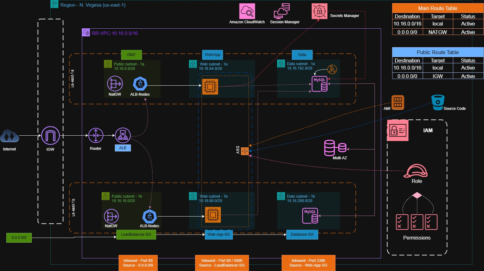

---

## Deployment Screenshots

---

### VPC Resources

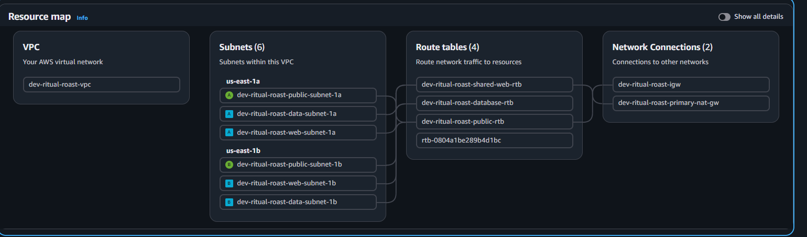

---

### Secrets Manager

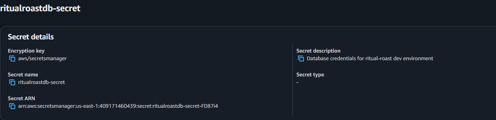

---

### S3 Bucket

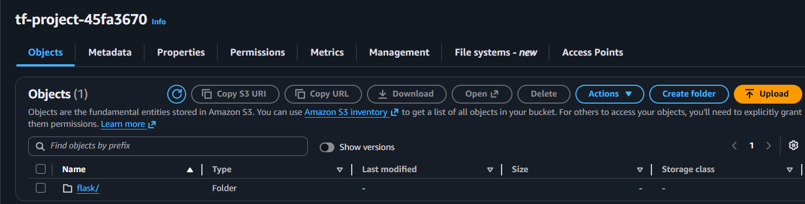

---

### RDS MySQL Database

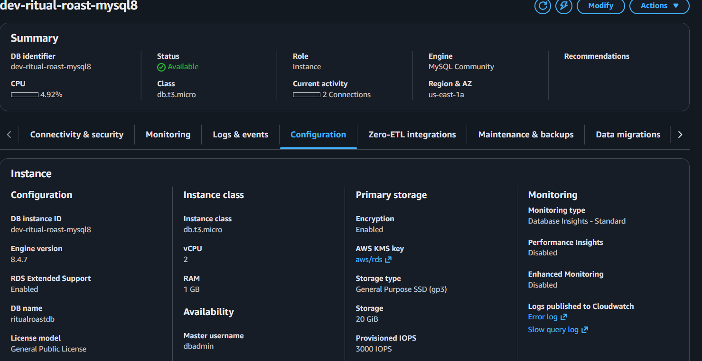

---

### IAM

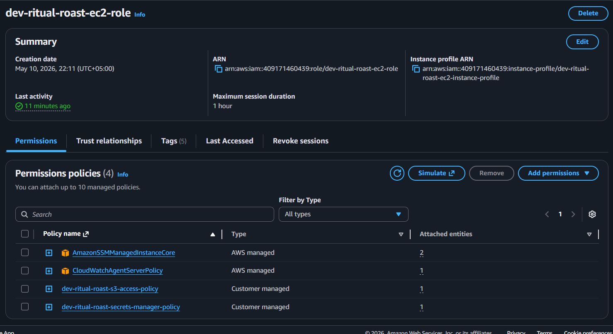

---

### Target Group

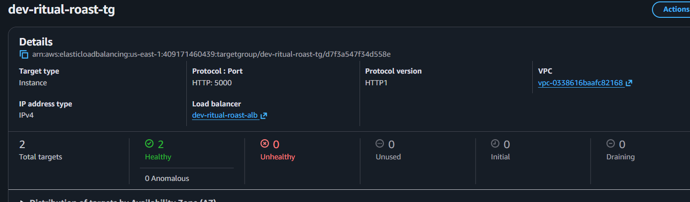

---

### Application Load Balancer

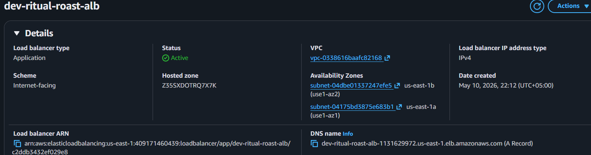

---

### Auto Scaling Group

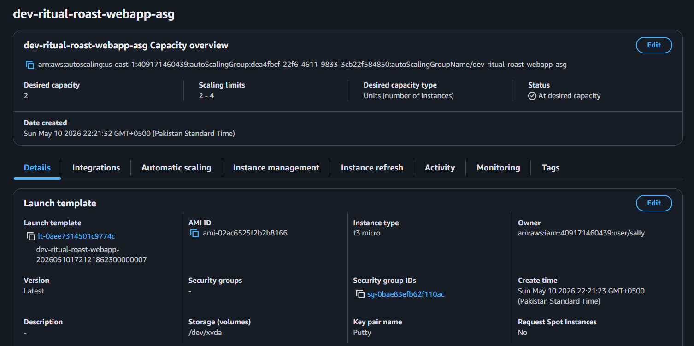

---

### EC2 Instances

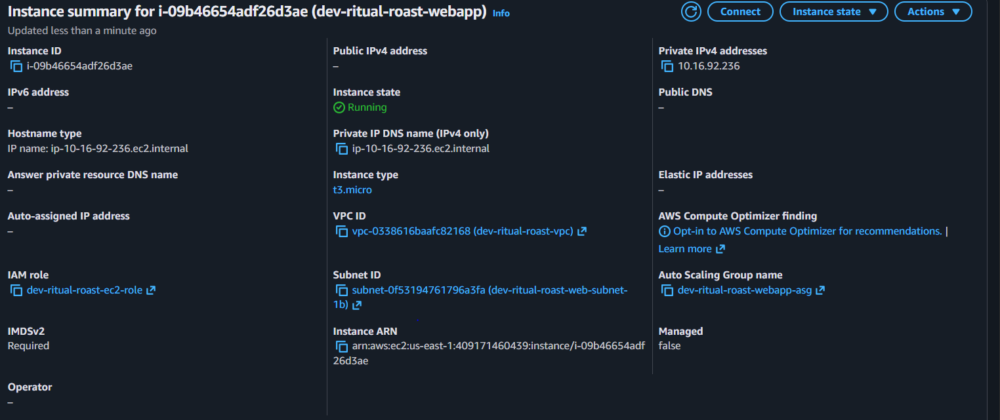

---

### Flask Web Application

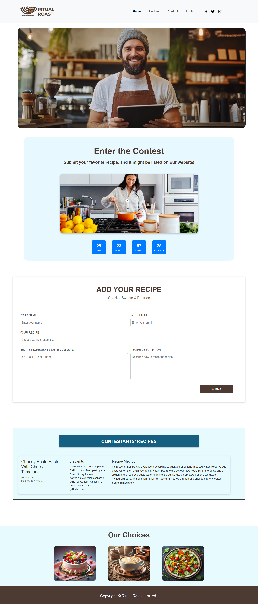

---
