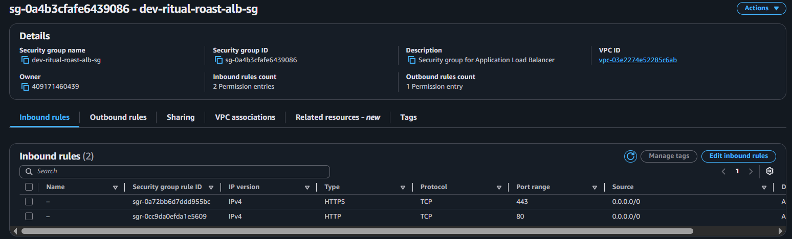
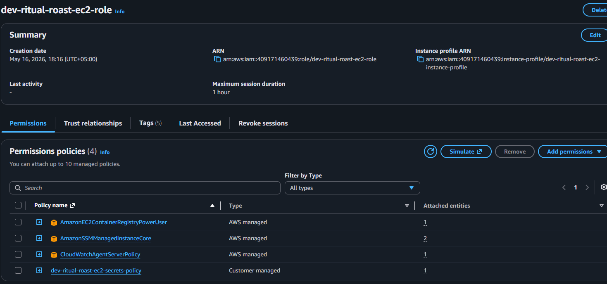
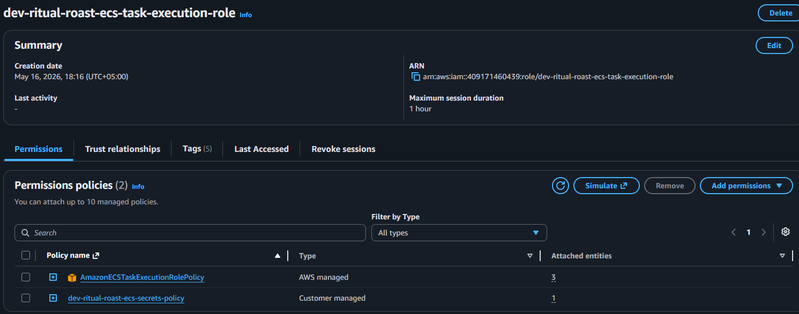
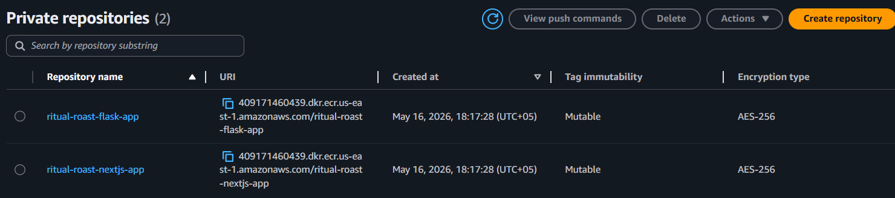
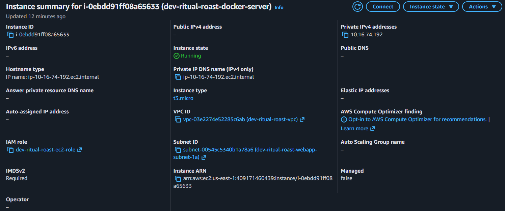
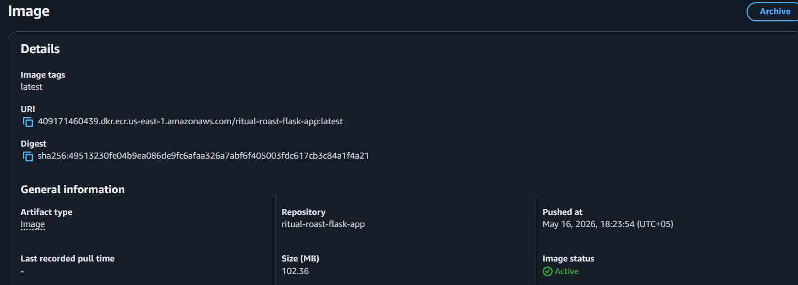
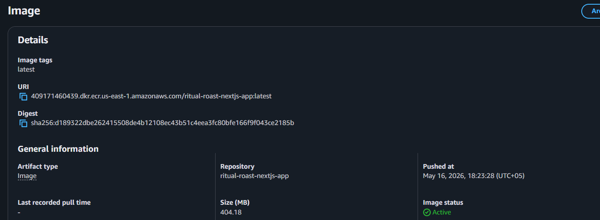

## Architecture Diagram

---

## Deployment Screenshots

---

### VPC Resources

---

### Security Groups

---

### Secrets Manager

---

### RDS MySQL Database

---

### IAM

---

### ECR

---

### EC2 Docker Server

---

### ECR Images

---

### ALB

