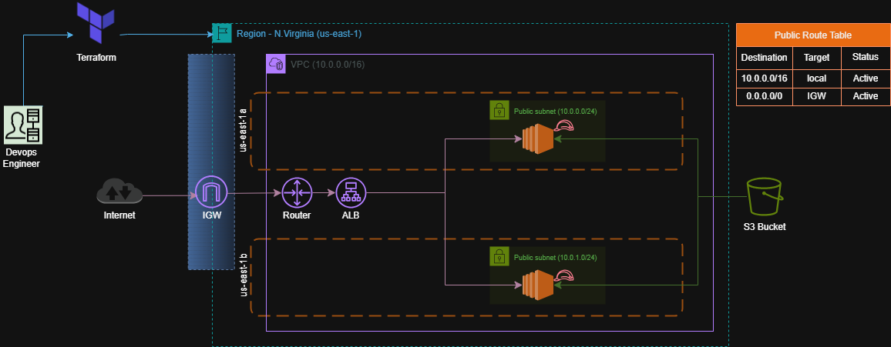
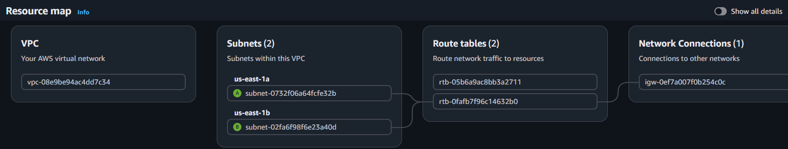
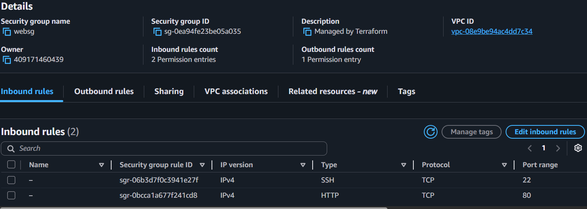
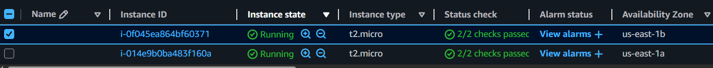
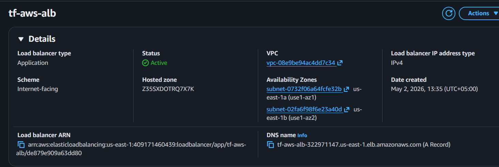
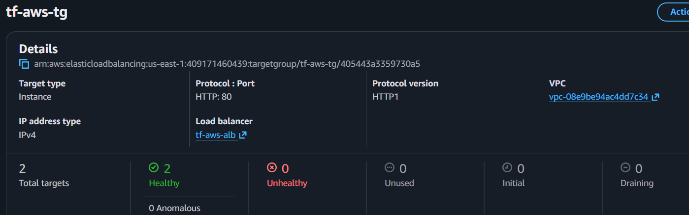
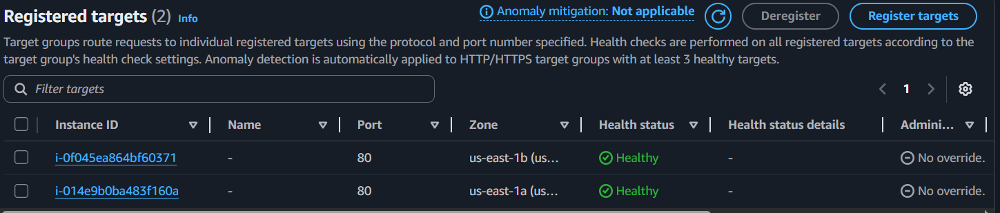
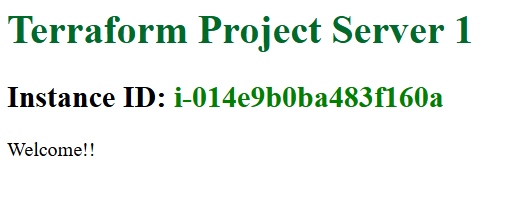

# AWS Terraform 2-Tier Web Architecture (with Load Balancer)

---

---

### **Table of Contents**
- [Project Overview](#1-project-overview)
- [Architecture Diagram](#2-architecture-diagram)
- [Infrastructure Components](#3-infrastructure-components)
  - [Custom VPC](#1-custom-vpc)
  - [Public Subnets](#2-public-subnets)
  - [Internet Gateway](#3-internet-gateway)
  - [Route Table](#4-route-table)
  - [Security Group](#5-security-group)
  - [S3 Bucket](#6-s3-bucket)
  - [EC2 Instances (Web Servers)](#7-ec2-instances-web-servers)
  - [Application Load Balancer (ALB)](#8-application-load-balancer-alb)
- [High Availability Design](#4-high-availability-design)
- [How to Deploy](#5-how-to-deploy)
  - [Initialize Terraform](#1-initialize-terraform)
  - [Validate Infrastructure](#2-validate-infrastructure)
  - [Plan Infrastructure](#3-plan-infrastructure)
  - [Apply Infrastructure](#4-apply-infrastructure)
  - [Destory Infrastructure](#5-destroy-infrastructure)
- [Skills Demonstrated](#6-skills-demonstrated)

---

### **1. Project Overview**

This project provisions a highly available web architecture on AWS using Terraform. It includes a custom VPC, public subnets across two availability zones, EC2 instances running a simple web server, an Application Load Balancer, and an S3 bucket.

The architecture demonstrates core DevOps and Cloud skills including:
* Infrastructure as Code (Terraform)
* AWS networking (VPC, subnets, routing)
* EC2 provisioning
* Security groups configuration
* Load balancing (ALB)

---

### **2. Architecture Diagram**

---



---

### **3. Infrastructure Components**

---

#### 1. Custom VPC
* CIDR block defined for isolated networking
* Enables full control over AWS networking



---

```bash
resource "aws_vpc" "vpc" {
  cidr_block = var.cidr
}
```

---

#### 2. Public Subnets

* Two public subnets deployed in:
  * us-east-1a
  * us-east-1b
* Used for high availability across AZs

```bash
resource "aws_subnet" "subnet1" {
  vpc_id                  = aws_vpc.vpc.id
  cidr_block              = "10.0.0.0/24"
  availability_zone       = "us-east-1a"
  map_public_ip_on_launch = true
}

resource "aws_subnet" "subnet2" {
  vpc_id                  = aws_vpc.vpc.id
  cidr_block              = "10.0.1.0/24"
  availability_zone       = "us-east-1b"
  map_public_ip_on_launch = true
}
```

---

#### 3. Internet Gateway (IGW)
* Attached to VPC
* Provides internet access to public subnets

```bash
resource "aws_internet_gateway" "igw" {
  vpc_id = aws_vpc.vpc.id
}
```

---

#### 4. Route Table
* Custom route table created

```bash
resource "aws_route_table" "rtb" {
  vpc_id = aws_vpc.vpc.id

  route {
    cidr_block = "0.0.0.0/0"
    gateway_id = aws_internet_gateway.igw.id
  }
}
```

* Associated with both public subnets

```bash
resource "aws_route_table_association" "rta1" {
  subnet_id      = aws_subnet.subnet1.id
  route_table_id = aws_route_table.rtb.id
}

resource "aws_route_table_association" "rta2" {
  subnet_id      = aws_subnet.subnet2.id
  route_table_id = aws_route_table.rtb.id
}
```

---

#### 5. Security Group

Allows inbound traffic:



```bash
resource "aws_security_group" "sg" {
  name   = "websg"
  vpc_id = aws_vpc.vpc.id

  ingress {
    description = "HTTP from VPC"
    from_port   = 80
    to_port     = 80
    protocol    = "tcp"
    cidr_blocks = ["0.0.0.0/0"]
  }

  ingress {
    description = "Allow SSH"
    from_port   = 22
    to_port     = 22
    protocol    = "tcp"
    cidr_blocks = ["0.0.0.0/0"]
  }

  egress {
    from_port   = 0
    to_port     = 0
    protocol    = "-1"
    cidr_blocks = ["0.0.0.0/0"]
  }

  tags = {
    Name = "Web-SG"
  }
}
```

---

#### 6. S3 Bucket
* Create S3 bucket to store objects like files:

```bash
resource "aws_s3_bucket" "tf-bucket" {
  bucket = "asadjvdtfawsbucket"
}
```

---

#### 7. EC2 Instances (Web Servers)
* 2 instances deployed in different subnets:
  * Instance 1 → us-east-1a
  * Instance 2 → us-east-1b
   
```bash
resource "aws_instance" "tf-instance1" {
  ami                    = "ami-05cf1e9f73fbad2e2"
  instance_type          = "t2.micro"
  vpc_security_group_ids = [aws_security_group.sg.id]
  subnet_id              = aws_subnet.subnet1.id
  user_data              = base64encode(file("${path.module}/Scripts/userdata1.sh"))
}

resource "aws_instance" "tf-instance2" {
  ami                    = "ami-05cf1e9f73fbad2e2"
  instance_type          = "t2.micro"
  vpc_security_group_ids = [aws_security_group.sg.id]
  subnet_id              = aws_subnet.subnet2.id
  user_data              = base64encode(file("${path.module}/Scripts/userdata2.sh"))
}
```

---



---

**User Data Script (Bootstrap)**

* Each instance runs a bash script that:
  * Fetches instance metadata
  * Displays instance ID
  * Serves a simple web page

```bash
#!/bin/bash
apt update
apt install -y apache2

# IMDSv2 token
TOKEN=$(curl -X PUT "http://169.254.169.254/latest/api/token" \
  -H "X-aws-ec2-metadata-token-ttl-seconds: 21600")

# Get instance ID
INSTANCE_ID=$(curl -H "X-aws-ec2-metadata-token: $TOKEN" \
  -s http://169.254.169.254/latest/meta-data/instance-id)

# Install the AWS CLI
apt install -y awscli

# Download the images from S3 bucket
#aws s3 cp s3://myterraformprojectbucket2023/project.webp /var/www/html/project.png --acl public-read

# Create a simple HTML file with the portfolio content and display the images
cat <<EOF > /var/www/html/index.html
<!DOCTYPE html>
<html>
<head>
  <title>My Portfolio</title>
  <style>
    /* Add animation and styling for the text */
    @keyframes colorChange {
      0% { color: red; }
      50% { color: green; }
      100% { color: blue; }
    }
    h1 {
      animation: colorChange 2s infinite;
    }
  </style>
</head>
<body>
  <h1>Terraform Project Server 1</h1>
  <h2>Instance ID: <span style="color:green">$INSTANCE_ID</span></h2>
  <p>Welcome!!</p>
  
</body>
</html>
EOF

# Start Apache and enable it on boot
systemctl start apache2
systemctl enable apache2
```

---

#### 8. Application Load Balancer (ALB)
* Distributes traffic across both EC2 instances
* Ensures high availability
* Health checks configured on HTTP port 80

```bash
resource "aws_lb" "alb" {
  name               = "tf-aws-alb"
  internal           = false
  load_balancer_type = "application"

  security_groups = [aws_security_group.sg.id]
  subnets         = [aws_subnet.subnet1.id, aws_subnet.subnet2.id]

  tags = {
    Name = "web"
  }
}

resource "aws_lb_target_group" "tg" {
  name     = "tf-aws-tg"
  port     = 80
  protocol = "HTTP"
  vpc_id   = aws_vpc.vpc.id

  health_check {
    path = "/"
    port = "traffic-port"
  }
}

resource "aws_lb_target_group_attachment" "attach1" {
  target_group_arn = aws_lb_target_group.tg.arn
  target_id        = aws_instance.tf-instance1.id
  port             = 80
}

resource "aws_lb_target_group_attachment" "attach2" {
  target_group_arn = aws_lb_target_group.tg.arn
  target_id        = aws_instance.tf-instance2.id
  port             = 80
}

resource "aws_lb_listener" "listener" {
  load_balancer_arn = aws_lb.alb.arn
  port              = 80
  protocol          = "HTTP"

  default_action {
    target_group_arn = aws_lb_target_group.tg.arn
    type             = "forward"
  }
}

output "loadbalancerdns" {
  value = aws_lb.alb.dns_name
}
```

---



---



---



---



---

### **4. High Availability Design**
EC2 instances deployed in two Availability Zones
Load Balancer ensures:
* fault tolerance
* traffic distribution
* automatic failover

---

### **5. How to Deploy**
#### 1. Initialize Terraform

```bash
terraform init
```

#### 2. Validate configuration

```bash
terraform validate
```

#### 3. Plan infrastructure

```bash
terraform plan
```

#### 4. Apply infrastructure

```bash
terraform apply --auto-approve
```

#### 5. Destroy infrastructure

```bash
terraform destroy
```

---

### **6. Skills Demonstrated**
* AWS VPC Networking
* Subnet design across AZs
* EC2 provisioning with user data
* Load balancing (ALB)
* Infrastructure as Code (Terraform)
* Basic DevOps automation
* Cloud architecture design

---
